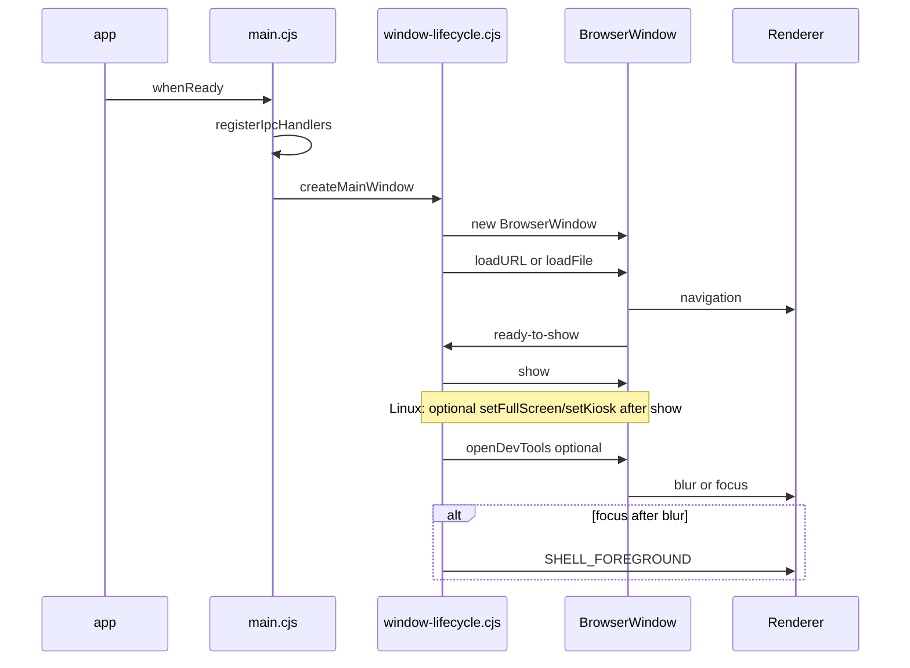

# Electron window lifecycle (main process)

This document describes how the Orange TV **launcher shell** window is created and how **dev** vs **fullscreen / kiosk** modes behave. Implementation lives under [`launcher/electron/`](../launcher/electron/).

## Lifecycle sequence

1. **`app.whenReady`** — `main.cjs` logs [`getShellWindowMode`](#shell-modes) and calls **`createWindow()`**.
2. **`createMainWindow`** ([`window-lifecycle.cjs`](../launcher/electron/window-lifecycle.cjs)) — reads [`getWindowChromeOptions`](../launcher/electron/shell-profile.cjs) from the primary display **work area**, creates **`BrowserWindow`** with `show: false`, attaches diagnostics, wires **blur/focus** (for [`SHELL_FOREGROUND`](gamepad-focus-recovery.md)), and starts **load** (`loadURL` in dev, `loadFile` for `dist` in prod).
3. **`ready-to-show`** — **`show()`**, then on **Linux** only **[`applyPostShowFullscreenChrome`](../launcher/electron/window-lifecycle.cjs)** may call **`setFullScreen` / `setKiosk`** again so some window managers honor fullscreen reliably.
4. **DevTools** — optional when `ELECTRON_IS_DEV` and `ORANGETV_ELECTRON__OPEN_DEVTOOLS` (never in appliance profile). See [`environment.md`](environment.md).
5. **Runtime** — blur/focus drives `orange-tv:shell-foreground` for renderer focus recovery.

## Shell modes

| Mode | Typical env | Window behavior |
| --- | --- | --- |
| **Dev windowed** | `ELECTRON_IS_DEV=1`, profile not `appliance`, no kiosk | Centered size capped at 1280×720 (within work area). |
| **Appliance fullscreen** | `ORANGETV_ELECTRON__SHELL_PROFILE=appliance` | Work-area size, `fullscreen: true`, minimal metadata in preload. |
| **Kiosk** | `ORANGETV_ELECTRON__KIOSK=1` (or `true`) | Fullscreen + Electron **kiosk** (stricter than fullscreen alone). |

`getShellWindowMode()` in [`shell-profile.cjs`](../launcher/electron/shell-profile.cjs) summarizes these flags for logging; **`getWindowChromeOptions`** remains the single source for **width/height/position/fullscreen/kiosk**.

## Fullscreen toggles (debug / validation)

- **F11** (main process): when **`ELECTRON_IS_DEV=1`** and profile is **not** appliance, registers a global shortcut to **toggle fullscreen** (`setFullScreen`). Useful on Linux VMs without changing renderer code.
- **IPC** `orange-tv:window-set-fullscreen` with `{ fullscreen: boolean }`: exposed on **`window.orangeTv.setFullscreen`** from [`preload.cjs`](../launcher/electron/preload.cjs). Does not require React; useful from DevTools: `await window.orangeTv.setFullscreen(true)`.

## Troubleshooting

| Symptom | Checks |
| --- | --- |
| Blank window | Confirm Vite dev server URL (`VITE_DEV_SERVER_URL` or `http://127.0.0.1:5173`) or `npm run build` for `electron:prod`. |
| Load error dialog | Stderr lines prefixed **`[OrangeTv:shell]`** — see [`electron-shell.md`](electron-shell.md). |
| Fullscreen not filling display (Linux) | Try appliance/kiosk env; post-show fullscreen/kiosk on Linux is applied in [`window-lifecycle.cjs`](../launcher/electron/window-lifecycle.cjs). Some WMs need kiosk mode or compositor settings. |
| F11 does nothing | **GlobalShortcut** can fail if another app owns the accelerator; check logs for `F11 fullscreen shortcut not registered`. |

## Related

- [electron-shell.md](electron-shell.md) — security, preload API, logging
- [environment.md](environment.md) — Electron env vars
- [Windows local setup](local-setup-windows.md) / [Ubuntu VM](local-setup-ubuntu-vm.md) — Electron sections
