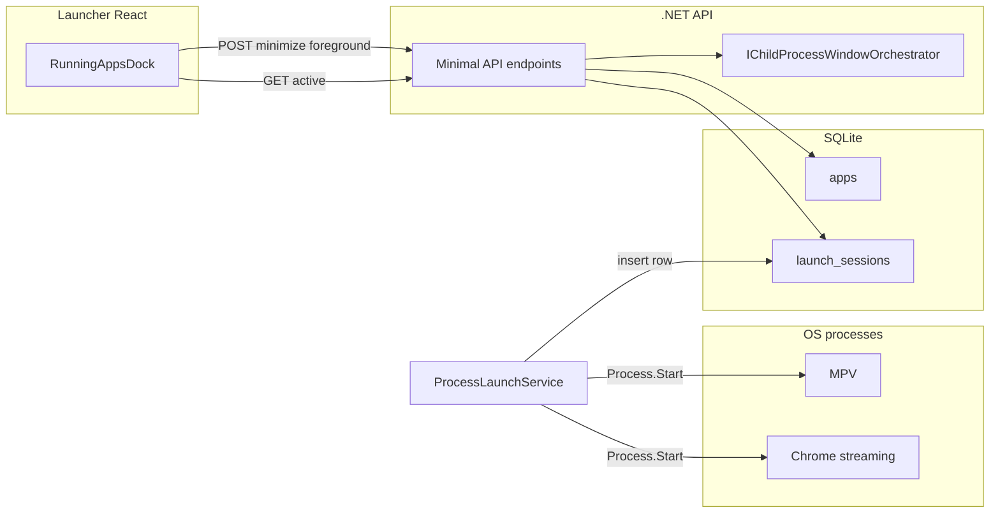

# Launch sessions and OS windowing

This document describes how Orange TV tracks **externally launched** Chrome and MPV processes, how the **HTTP API** exposes active sessions, and how **minimize** and **foreground** interact with the OS. For shell-only fullscreen lock (Electron), see [`electron-shell.md`](electron-shell.md) and [`environment.md`](environment.md).

## Architecture

- **`ProcessLaunchService`** starts child processes and persists **`LaunchSessionEntity`** rows (`api/Data/Entities/LaunchSessionEntity.cs`).
- **`EndedAtUtc`** is set when the child process exits (exit watcher in the same service).
- The launcher **does not** embed streaming UIs; sessions refer to **OS PIDs**.

## Data model

| Field | Purpose |
| --- | --- |
| `Id` | Session id (GUID), returned to the client on launch as `sessionId`. |
| `AppId` | Foreign key to `apps.id`. |
| `Pid` | OS process id for window targeting (Windows Win32). |
| `StartedAtUtc` / `EndedAtUtc` | Active sessions have `EndedAtUtc == null`. |
| `MediaItemId` | Optional link for library MPV launches. |

Active list query: inner join `launch_sessions` to `apps` for **`label`** and app **`type`** (exposed as **`kind`** in JSON, lowercased).

## HTTP API

Base path: `/api/v1/launch/sessions`

| Method | Path | Success | Notes |
| --- | --- | --- | --- |
| `GET` | `/active` | **200** `{ items: [...] }` | Empty array when nothing running. |
| `POST` | `/{sessionId}/minimize` | **200** `{ ok: true }` or **200** `{ ok: false, reason }` | **404** if session missing or already ended. **501** on non-Windows (`unsupported-platform`). |
| `POST` | `/{sessionId}/foreground` | Same as minimize | Same status semantics. |

JSON property names use **camelCase** (ASP.NET Core default).

### Windows behavior

`WindowsChildProcessWindowOrchestrator` resolves an HWND for the PID (`Process.MainWindowHandle` or `EnumWindows` fallback), then `ShowWindow` (minimize / restore) and `SetForegroundWindow`.

### Linux and macOS

`UnsupportedChildProcessWindowOrchestrator` returns failure with `unsupported-platform`; endpoints respond with **501** and `{ ok: false, reason }`. **`GET .../active`** still works so the **Running apps** dock can show **what** is running.

## Launcher UI and Electron

1. **`useActiveLaunchSessions`** polls **`GET /api/v1/launch/sessions/active`** (short interval).
2. **Minimize** calls **`POST .../minimize`**; on **`ok: true`**, the renderer invokes **`window.orangeTv.focusShell()`** (`orange-tv:shell-focus`) so the Electron shell is restored and focused.
3. **Switch** calls **`POST .../foreground`** to bring the streaming window forward.

See [`electron-shell.md`](electron-shell.md) for **`focusShell`**.

## Limitations (read before filing bugs)

- **Chrome** may open multiple top-level windows; PID→HWND mapping is best-effort (see implementation in `api/Platform/WindowsChildProcessWindowOrchestrator.cs`).
- **True OS-wide kiosk** (e.g. blocking Alt+Tab) is **not** implemented by this API; see [`electron-shell.md`](electron-shell.md) → *OS-wide lock vs shell lock*.
- **Wayland** on Linux may restrict scripted focus from other toolkits; non-Windows minimize/foreground remains **unimplemented** until a dedicated backend (e.g. X11 tools, compositor-specific APIs) is added.

## OpenAPI (development)

With **`ASPNETCORE_ENVIRONMENT=Development`**, the API maps OpenAPI. After starting the API, you can inspect the generated document (typical path **`/openapi/v1.json`**) to verify routes when adding endpoints—exact path follows the **Microsoft.AspNetCore.OpenApi** convention for your ASP.NET version.

## Related

- [`environment.md`](environment.md) — env vars and endpoint list
- [`testing-matrix-v1.md`](testing-matrix-v1.md) — platform expectations for session APIs vs Win32
